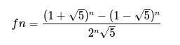
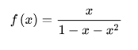

## Exercise 1
___
>**The first is the Fibonacci function:** which consists in the development of the formula:

$$$ fn = (fn-1) + (fn-2): $$$ $$$ f0 ----------- $$$ $$$ f1 ----------- $$$ $$$ f2 = f1+f0 =1----- $$$ $$$ f3 = f2+f1 =2----- $$$

<div align="justify"> Fibonacci by function: in which we declare n what our Fibonacci number will be, t1 it will be our temporary variable and t2 will save the result of our succession,we will make a cycle that goes from 0 to n, where we have a time variable t2 = f,f is the accumulator of t + f and t1 where this will be the result Fibonacci
</div>

```scala
var n,f=0
var t1=1
n=20
var t2=1
for(i <- Array.range(0,n+1)){
    t2=f
    f=t1+f
    t1=t2
    println(t1)

}

```
<br>

## Exercise 2
___
>**Fibonacci Explicit formula:** first we have a number n  n = Fibonacci Succession number, a *'for'* cycle in which it reaches the sequence n, to show all the Fibonacci succession results up to n, fibonnaci will be equal to the following formula:



```scala
n=20
for(n <- Array.range(0,n+1))
{
var fibonnaci =(Math.pow(((1+Math.sqrt(5))/2),n)-Math.pow(((1-Math.sqrt(5))/2),n))/Math.sqrt(5)
println(fibonnaci)
}
```

## Exercise 3
___
>**Recursive Fibonacci:** for this a method called `'fib'` was developed that has as a parameter n Fibonacci sequence number, the return of the function will be an integer, where **n** will only be returned when n is less than 2, if the following formula is not applied :



```scala
def fib(n:Int):Int={
    if(n<2){
        return n
    }else{
        return (fib(n-1)+fib(n-2))
    }
    
}
fib(20)
```

## Excersice 4

> The iterative Fibonacci version algorithm with 2 cables was performed in which the function receives an int value and returns an int

```scala
def fib(n:Int ):Int={
    a=0
    b=1
    for (k<- Range(0,n)){
        b=b+a
        a=b-a
    }
    return a
}

fib(10)
```
> Fibonacci iterative version vector uses a function that receives an int data and returns a double, the algorithm makes use of a vector with length n + 1, a for which runs the vector and a condition

## Exercise 5

```scala
def fibo(n :Int):Double={
    if(n<2){
        return n
    }else{
        var vec = new  Array[Double](n+1)
        vec(0) = 0
        vec(1) = 1
        for (k<- Range(2,n+1)){
            vec(k)=vec(k-1)+vec(k-2)
        }
        return vec(n)
    }
    
}

fibo (10)
```


## Exercise 6

> Fibonacci version divide and conquer, use the library scala.math.pow to elvar a number to an exponent. In the algorithm, exponents, a module and tuples are used.

```scala

import scala.math.pow

def fib(n :Int):Double={
    if(n<=0){
        return 0
    }

    var i = n-1
    var aux1 =0.0
    var aux2=1.0

    var ab=(aux2,aux1)
    var cd=(aux1,aux2)

    while(i>0){
        if((i%2)!=0){
            aux1=(cd._2*ab._2)+(cd._1*ab._1)
            aux2=(cd._2*(ab._2+ab._1)+cd._1*ab._2)
            ab=(aux1,aux2)
        }
        aux1=pow(cd._1,2)+pow(cd._2,2)
        aux2=(cd._2*(2*cd._1+cd._2))
        cd=(aux1,aux2)
        i=i/2
    }
    return (ab._1+ab._2)

}

fib(10)
```
