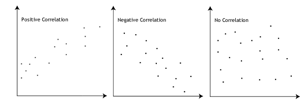
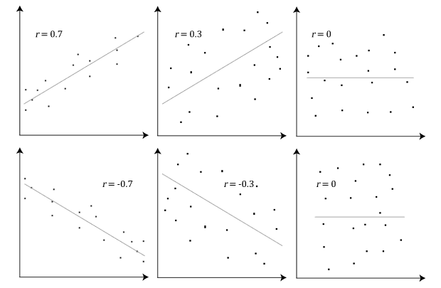
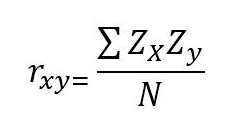

# Pearson correlation

## Correlacion 

 A correlation coefficient measures the degree of relationship or association generally existing between two random variables. It is not convenient to identify correlation with causal dependence, since, if there is a formal similarity between the two concepts, it cannot be deduced from this that they are analogous; indeed it is possible that there is a high correlation between two events and that, however, there is no cause or effect relationship between them; For example, when two events have some common cause, they can be highly associated and are not the cause of the other. It should be remembered that the coefficient fluctuates between -1 ≤ ρ ≤ 1.

## What is the Pearson correlation coefficient?

 The Pearson Correlation Coefficient is a measure of the correspondence or linear relationship between two random quantitative variables. In simpler words it can be defined as an index used to measure the degree of relationship that two variables have, both quantitative.

 Having two variables, the correlation facilitates estimates of the value of one of them, with knowledge of the value of the other variable.

 This coefficient is a measure that indicates the relative situation of the events with respect to the two variables, that is, it represents the numerical expression that indicates the degree of correspondence or relationship that exists between the 2 variables. These numbers vary between limits of +1 and -1.

## What values can the Pearson correlation coefficient take?

 The Pearson correlation coefficient, r, can take a range of values from +1 to -1. A value of 0 indicates that there is no association between the two variables. A value greater than 0 indicates a positive association; that is, as the value of one variable increases, so does the value of the other variable. A value less than 0 indicates a negative association; that is, as the value of one variable increases, the value of the other variable decreases. This is shown in the diagram below:

## How can we determine the strength of association based on the Pearson correlation coefficient?

 The stronger the association of the two variables, the closer the Pearson correlation coefficient, r, will be to either +1 or -1 depending on whether the relationship is positive or negative, respectively. Achieving a value of +1 or -1 means that all your data points are included on the line of best fit – there are no data points that show any variation away from this line. Values for r between +1 and -1 (for example, r = 0.8 or -0.4) indicate that there is variation around the line of best fit. The closer the value of r to 0 the greater the variation around the line of best fit. Different relationships and their correlation coefficients are shown in the diagram below:

## How is it calculated?
To have a guide that allows:

* Establish the contiguous variation of the two variables
* Compare the different cases with each other

 To do this, Pearson's correlation coefficient is used, defined as the covariance that occurs between two typified variables and is calculated with the following expression:

 
 <strong> When it is less than zero ( r < 0 ) It is said that there is a negative correlation:</strong>
  
 The variables are correlated in an inverse sense.At high values in one of the variables, low valuesusually correspond to the other variable and vice versa. How much the value will be closer to -1 said most obvious correlation coefficient will be extreme covariation.

 
 
 
 <strong>If r = -1 there is talk of a perfect negative correlation </strong>, which assumes a definite absolute between both variables, in a direct sense a perfect linear relationship of negative slope coexists.

 
 

 <strong> When it is greater than zero -(r> 0) It is said that there is a positive correlation:</strong> Both variables are correlated in a direct sense.High values in one of the variables correspond to high values in the other variable and also in an inverse situation with low values. The closer to +1 the correlation coefficient is found, the more obvious the covariation will be.

 
 

 <strong>If r = 1 There is talk of a perfect positive correlation</strong>, which implies an absolute determination between the variables, in a direct sense a perfect linear relationship of positive slope coexists).
 
 

 <strong>When it is equal to zero (r = 0) The variables are said to be incorrectly related </strong>, some sense of covariation cannot be established.There is no linear relationship, but this does not imply that the variables are independent, and there may be non-linear relationships between the variables.

 

## References

* Restrepo, L. F., & González, J. (2007). From pearson to Spearman. Revista Colombiana de Ciencias Pecuarias, 20(2), 183-192.

* Matias Riquelme. (May 11, 2019). ¿Qué Es Y Cómo Se Interpreta El Coeficiente De Correlación De Pearson?. 2020, de Web y empresas Sitio web: https://www.webyempresas.com/coeficiente-de-correlacion-de-pearson/

* “Pearson Product-Moment Correlation.” Pearson Product-Moment Correlation - When You Should Run This Test, the Range of Values the Coefficient Can Take and How to Measure Strength of Association., statistics.laerd.com/statistical-guides/pearson-correlation-coefficient-statistical-guide.php.
