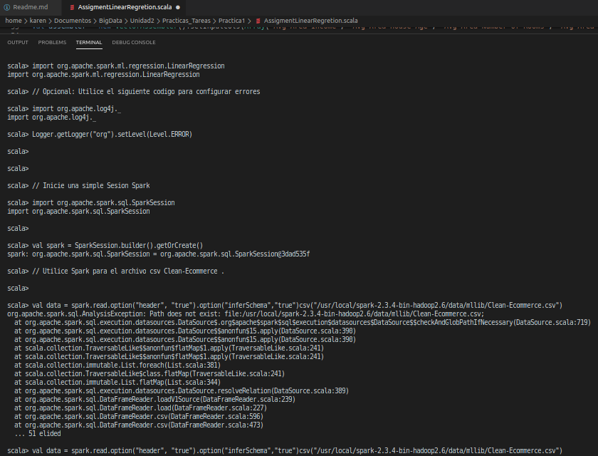
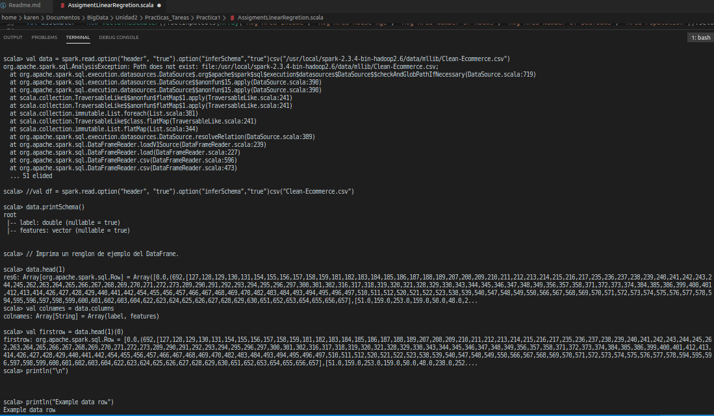
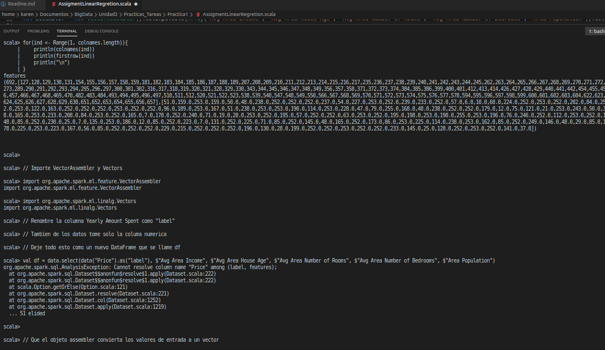
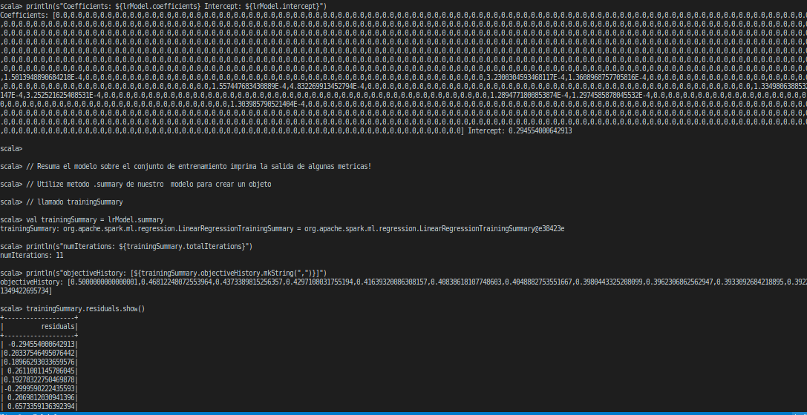
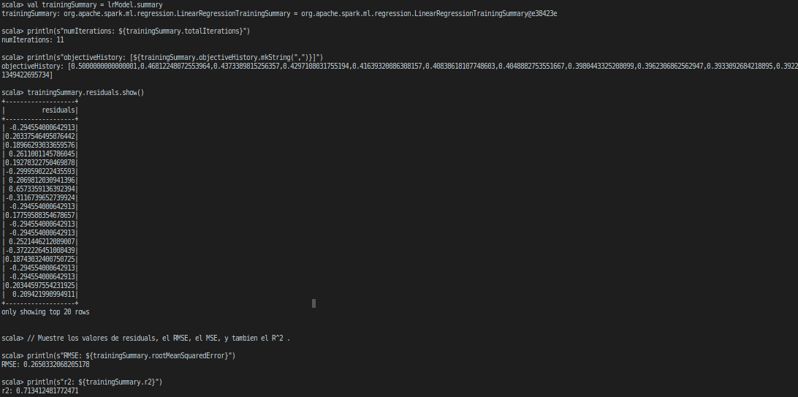

### :memo: PRACTICE 1: LINEAR REGRESSION EXERCISE 

> Import LinearRegression
```scala
import org.apache.spark.ml.regression.LinearRegression
```
> Optional: Use the following code to configure errors
```scala
import org.apache.log4j._
Logger.getLogger("org").setLevel(Level.ERROR)
```

> Start a simple Spark Session
```scala
import org.apache.spark.sql.SparkSession
val spark = SparkSession.builder().getOrCreate()
```

> Use Spark for the Clean-Ecommerce csv file.
```scala
val data = spark.read.option("header", "true").option("inferSchema","true")csv("/usr/local/spark-2.3.4-bin-hadoop2.6/data/mllib/Clean-Ecommerce.csv")
```

> Print the schema in the DataFrame.
```scala
data.printSchema()
```

> Print a sample line from the DataFrane.
```scala
data.head(1)
```

> Transform the data frame
```scala
val colnames = data.columns
val firstrow = data.head(1)(0)
println("\n")
println("Example data row")
for(ind <- Range(1, colnames.length)){
    println(colnames(ind))
    println(firstrow(ind))
    println("\n")
}
```
> Import VectorAssembler and Vectors
```scala
import org.apache.spark.ml.feature.VectorAssembler
import org.apache.spark.ml.linalg.Vectors
```
> Rename the Yearly Amount Spent column as "label" Also from the data take only the numerical column Leave all this as a new DataFrame called df
 ```scala
val df = data.select(data("Price").as("label"), $"Avg Area Income", $"Avg Area House Age", $"Avg Area Number of Rooms", $"Avg Area Number of Bedrooms", $"Area Population")
```
> Let the assembly object convert the input values ​​to a vector
```scala
val assembler = new VectorAssembler().setInputCols(Array("Avg Area Income", "Avg Area House Age", "Avg Area Number of Rooms", "Avg Area Number of Bedrooms", "Area Population")).setOutputCol("features")
```

> Use the VectorAssembler object to convert the input columns of the df
 to a single output column of an array named "features"
 Set the input columns from where we are supposed to read the values.
 Call this a new assambler.
 Use the assembler to transform our DataFrame to two columns: label and features
```scala
val assembler = new VectorAssembler().setInputCol(Array("Avg Area Income", "Avg Area House Age", "Avg Area Number of Rooms", "Avg Area Number of Bedrooms", "Area Population")).setOutputCol("features")
```





