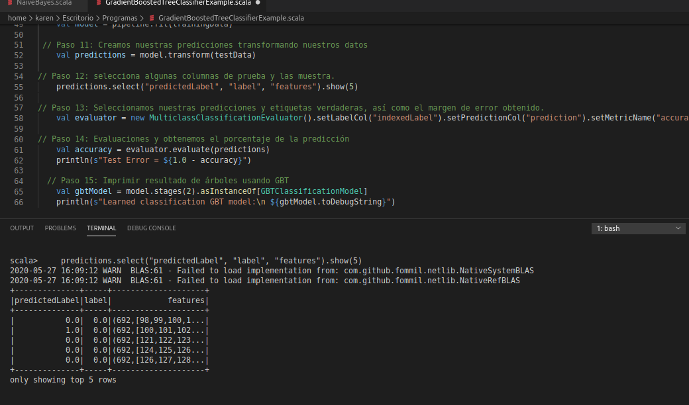
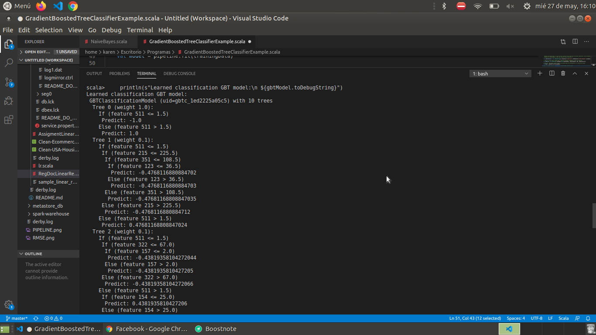

### :memo: PRACTICE 5: Gradient-boosted tree classifier
> Step 1: loading required packages and APIs
 ```scala
package org.apache.spark.examples.ml
import org.apache.spark.ml.Pipeline
import org.apache.spark.ml.classification.{GBTClassificationModel, GBTClassifier}
import org.apache.spark.ml.evaluation.MulticlassClassificationEvaluator
import org.apache.spark.ml.feature.{IndexToString, StringIndexer, VectorIndexer}
import org.apache.spark.sql.SparkSession
 ```

> Step 2: create a Spark session
 ```scala
    val spark = SparkSession.builder.appName("GradientBoostedTreeClassifierExample").getOrCreate()
``` 

> Step 3: handle data The first thing we must do is load our data file. The data is in CSV format
without a header line or quotes. We can open the file with the function of opening and reading the data lines
using the reader function in the CSV module.
 ```scala
    val data = spark.read.format("libsvm").load("/usr/local/spark-2.3.4-bin-hadoop2.6/data/mllib/sample_libsvm_data.txt")
 ```

> Step 4: Coding of categorical variable
In our data framework, we have numerical and categorical characteristics. But to enter the characteristics in our
 machine learning model, we have to transform all categorical attributes to numerical ones by indexing them. OR either our input characteristics or our label column for the model, we have to do it to train our model.
```scala
    val labelIndexer = new StringIndexer().setInputCol("label").setOutputCol("indexedLabel").fit(data)
 ```
> Step 5: We do not overwrite the features, but create new attributes by concatenating the name of the previous features and the string "Index". So that we can enter only those characteristics that we need for the training of the model and keep the real one intact. As if to say it, we index our labels to work them.
 ```scala
    val featureIndexer = new VectorIndexer().setInputCol("features").setOutputCol("indexedFeatures").setMaxCategories(4).fit(data)
 ```
> Step 6: preparing the training and test set Prepare the train and test set: training => 70%, test => 30%
```scala
    val Array(trainingData, testData) = data.randomSplit(Array(0.7, 0.3))
 ```
 
> Step 7: Train a GBT model
 ```scala
    val gbt = new GBTClassifier().setLabelCol("indexedLabel").setFeaturesCol("indexedFeatures").setMaxIter(10).setFeatureSubsetStrategy("auto")
 ```
> Step 8: Convert the indexed tags back to original tags.
In this step, we actually bring together all the features we need to enter a model.We have to provide the list of those numeric conversion type characteristics and those attributes categorical transformed and create a vector feature.
 ```scala
    val labelConverter = new IndexToString().setInputCol("prediction").setOutputCol("predictedLabel").setLabels(labelIndexer.labels)
 ```
> Step 9: we join our gbt model to our indexed labels through Pipeline
 ```scala
    val pipeline = new Pipeline().setStages(Array(labelIndexer, featureIndexer, gbt, labelConverter))
 ```
> Step 10: We train our pipeline using training data and the fit function
 ```scala
    val model = pipeline.fit(trainingData)
 ```
> Step 11: We create our predictions transforming our data
 ```scala
    val predictions = model.transform(testData)
 ```
> Step 12: select some test columns and display them.
 ```scala
    predictions.select("predictedLabel", "label", "features").show(5)
 ```
> Step 13: We select our predictions and true labels, as well as the margin of error obtained.
 ```scala
    val evaluator = new MulticlassClassificationEvaluator().setLabelCol("indexedLabel").setPredictionCol("prediction").setMetricName("accuracy")
 ```
> Paso 14: Evaluaciones y obtenemos el porcentaje de la predicción
 ```scala
    val accuracy = evaluator.evaluate(predictions)
    println(s"Test Error = ${1.0 - accuracy}")
 ```
> Step 15: Print tree result using GBT
   ```scala
    val gbtModel = model.stages(2).asInstanceOf[GBTClassificationModel]
    println(s"Learned classification GBT model:\n ${gbtModel.toDebugString}")
  ```

 

