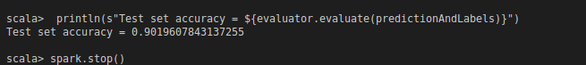

### :memo: PRÁCTICA 6: Linear Support Vector Machine

> Step 1: loading required packages and APIs
```scala
import org.apache.spark.ml.classification.MultilayerPerceptronClassifier
import org.apache.spark.ml.evaluation.MulticlassClassificationEvaluator
import org.apache.spark.sql.SparkSession
```


> An example of multilayer perceptron classification.
Step 2: create a Spark session
Where the class is as follows:

```scala
def main(args: Array[String]): Unit = {
    val spark = SparkSession.builder.appName("MultilayerPerceptronClassifierExample").getOrCreate()
```


> Step 3: load and analyze the dataset
Load the stored data in LIBSVM format as a DataFrame. Here Spark store is set to "/usr/local/spark-2.3.4-bin-hadoop2.6/data/mllib/s", but you need to configure its path accordingly
 ```scala
 val data = spark.read.format("libsvm").load("/usr/local/spark-2.3.4-bin-hadoop2.6/data/mllib/sample_multiclass_classification_data.txt")
 ```


> Step 4: prepare the training and test set
Prepare the train and the test set: training => 60%, test => 40% and seed => 12345L
Set seed to set randomness
 ```scala
    val splits = data.randomSplit(Array(0.6, 0.4), seed = 1234L)
    val train = splits(0)
    val test = splits(1)
```
> Step 5: specify the layers for the neural network
    Specify the layers for the neural network as follows:
    input layer => size 4 (characteristics),
    two intermediate layers (i.e. hidden layer)
    of size 5 and 4 and output => size 3 (classes). * /  
```scala 
    val layers = Array[Int](4, 5, 4, 3)
 ```

> Step 6: create the MultilayerPerceptronClassifier trainer and set its parameters
     value of perceptron, Sets the value of param [[blockSize]], sets the maximum number of iterations.
     The default value is 128 and 100 respectively
 ```scala
     val trainer = new MultilayerPerceptronClassifier().setLayers(layers).setBlockSize(128).setSeed(1234L).setMaxIter(100)
 ```

> Step 7: Train the multilayer perceptron classification model using the estimator
    Train the multilayer perceptron classification model using the estimator above (i.e. trainer)     
 ```scala
    val model = trainer.fit(train)
 ```
 
> Step 8: Calculate the prediction with in the test set
  ```scala
    val result = model.transform(test)
    val predictionAndLabels = result.select("prediction", "label")
 ```
     
> Step 9: Evaluate the model for prediction performance
   ```scala
    val evaluator = new MulticlassClassificationEvaluator().setMetricName("accuracy")
    println(s"Test set accuracy = ${evaluator.evaluate(predictionAndLabels)}")
   ```
   > Step 10: stop the Spark session
   ```scala
    spark.stop()
   ```
  > Step 11: dummy fit if necessary
if the classifier performance is low enough. One reason is that the Perceptron is very shallow.the size of the data set is also smaller; therefore we must continue to try to deepen at least increasing the size of the hidden layers.
  }
}


