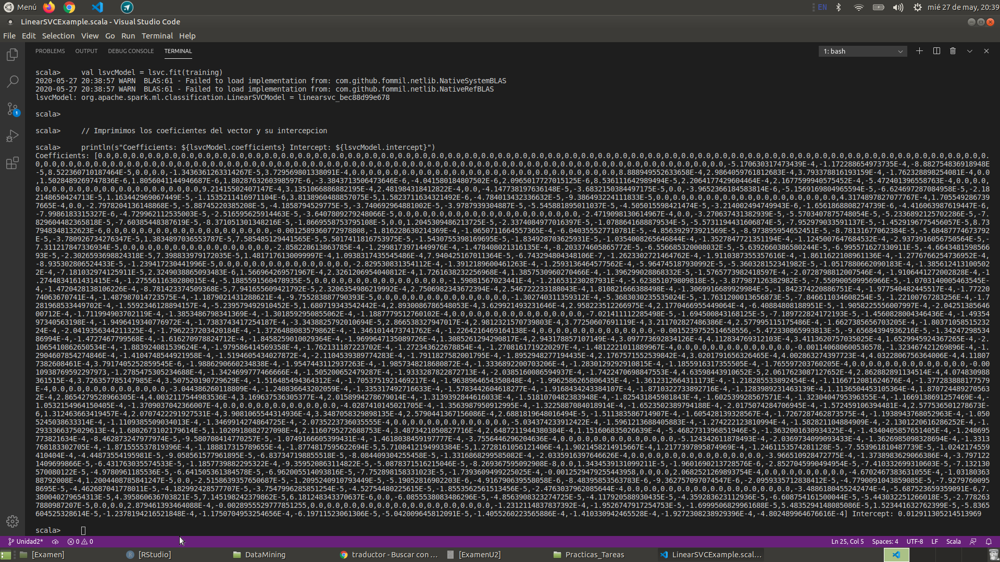

# SVC

> We import libraries
```scala
package org.apache.spark.examples.ml
```

> Library for SVC
```scala
import org.apache.spark.ml.classification.LinearSVC
import org.apache.spark.sql.SparkSession
```
> Create session spark variable
```scala
val spark = SparkSession.builder.appName("LinearSVCExample").getOrCreate()
```

> load the data from our file and add it to a variable to train
```scala
val training = spark.read.format("libsvm").load("/home/eduardo/Escritorio/semestre_9/BigData/Unidad2/Practicas_Tareas/Data/sample_libsvm_data.txt")
```

> create an object of type LinearSVC
> set the number of iterations to 10 with the setMaxIter method
> Set the regularization parameter
```scala
val lsvc = new LinearSVC().setMaxIter(10).setRegParam(0.1)
```

> Fit the model
```scala
val lsvcModel = lsvc.fit(training)
```

> We print the coefficients of the vector and its intersection
```scala
println(s"Coefficients: ${lsvcModel.coefficients} Intercept: ${lsvcModel.intercept}")
```
