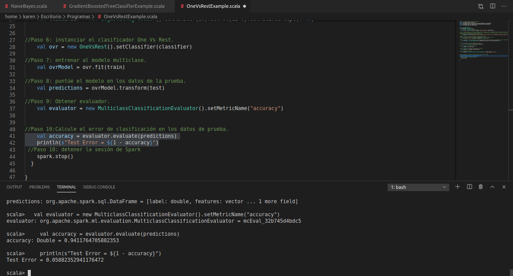

### :memo: PRACTICE 8: One-vs-Rest classifier (a.k.a. One-vs-All)
> Step 1: loading required packages and APIs
 ```scala
package org.apache.spark.examples.ml
import org.apache.spark.ml.classification.{LogisticRegression, OneVsRest}
import org.apache.spark.ml.evaluation.MulticlassClassificationEvaluator
import org.apache.spark.sql.SparkSession
 ```

> Step 2: create a Spark session
 ```scala
    val spark = SparkSession.builder.appName(s"OneVsRestExample").getOrCreate()
 ```
> Step 3: handle data The first thing we must do is load our data file. The data is in CSV format
without a header line or quotes. We can open the file with the function of opening and reading the data lines
using the reader function in the CSV module
 ```scala
    val inputData = spark.read.format("libsvm").load("/usr/local/spark-2.3.4-bin-hadoop2.6/data/mllib/sample_multiclass_classification_data.txt")
 ```
> Step 4: preparing the training and test set
Prepare the train and test set: training => 80%, test => 20%
 ```scala
    val Array(train, test) = inputData.randomSplit(Array(0.8, 0.2))
 ```
> Step 5: instantiate the base classifier; Maximum iterations, the convergence tolerance of the iterations, Set if we must adjust the intersection The default value is true.
 ```scala
    val classifier = new LogisticRegression().setMaxIter(10).setTol(1E-6).setFitIntercept(true)
 ```
   
> Step 6: instantiate the One Vs Rest classifier.
 ```scala
    val ovr = new OneVsRest().setClassifier(classifier)
 ```
> Step 7: train the multiclass model.
 ```scala
    val ovrModel = ovr.fit(train)
 ```
> Step 8: Score the model on the test data.
 ```scala
    val predictions = ovrModel.transform(test)
```

> Step 9: Get evaluator.
 ```scala
    val evaluator = new MulticlassClassificationEvaluator().setMetricName("accuracy")
```

> Step 10: Calculate the classification error in the test data.
 ```scala
    val accuracy = evaluator.evaluate(predictions)
    println(s"Test Error = ${1 - accuracy}")
 ```

> Step 11 stop Spark session
 ```scala
    spark.stop()
 ```
