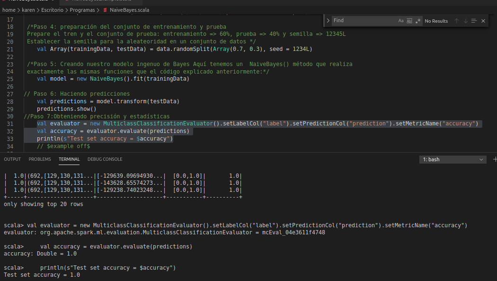

### :memo: PRACTICE 9: Naive Bayes

> Step 1: loading required packages and APIs
 ```scala
import org.apache.spark.ml.classification.NaiveBayes
import org.apache.spark.ml.evaluation.MulticlassClassificationEvaluator
import org.apache.spark.sql.SparkSession
 ```

> Step 2: create a Spark session
 ```scala
    val spark = SparkSession.builder.appName("NaiveBayesExample").getOrCreate()
 ```

> Step 3: handle data The first thing we must do is load our data file. The data is in CSV format.
without a header line or quotes. We can open the file with the function of opening and reading the data lines.
using the reader function in the CSV module.
 ```scala
    val data = spark.read.format("libsvm").load("/usr/local/spark-2.3.4-bin-hadoop2.6/data/mllib/sample_libsvm_data.txt")
 ```

> Step 4: preparing the training and test set
 Prepare the train and the test set: training => 60%, test => 40% and seed => 12345L
 Set seed for randomness in a dataset 
  ```scala
    val Array(trainingData, testData) = data.randomSplit(Array(0.7, 0.3), seed = 1234L)
 ```
> Step 5: Creating our naive Bayes model Here we have a NaiveBayes () method that performs
 exactly the same functions as the code explained above:
  ```scala
    val model = new NaiveBayes().fit(trainingData)
 ```

> Step 6: Making predictions
 ```scala
    val predictions = model.transform(testData)
    predictions.show()
 ```
> Step 7: Obtaining precision and statistics
 ```scala
    val evaluator = new MulticlassClassificationEvaluator().setLabelCol("label").setPredictionCol("prediction").setMetricName("accuracy")
    val accuracy = evaluator.evaluate(predictions)
    println(s"Test set accuracy = $accuracy")
```

> Step 8: stop Spark session
 ```scala
spark.stop()
 ```


