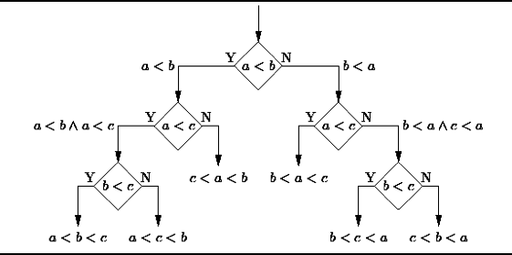
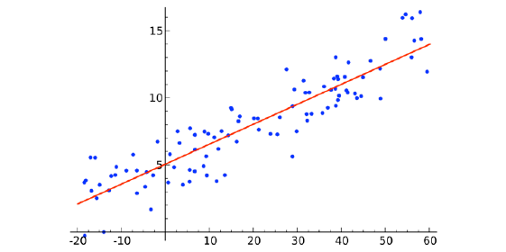
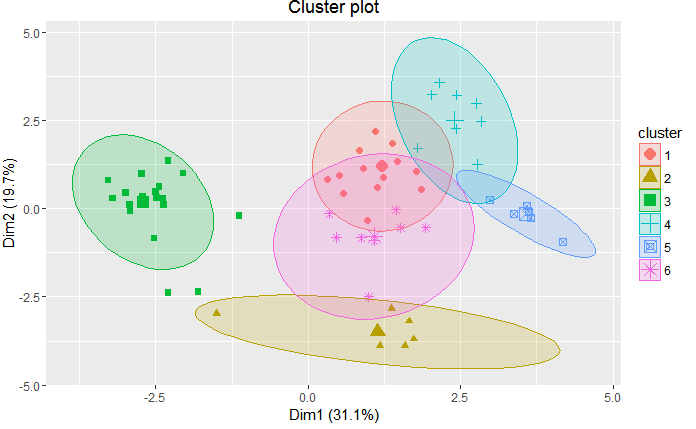
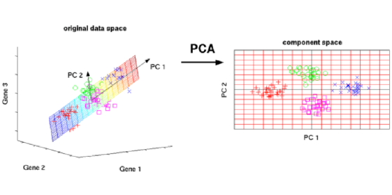
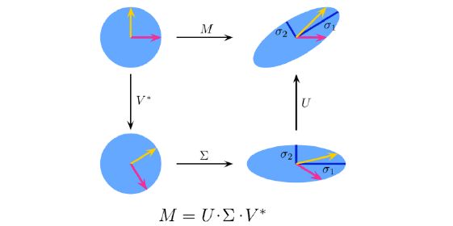
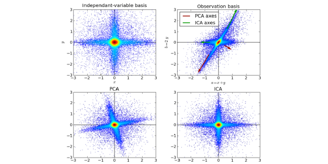

# 
 Principales algoritmos de ML 

## 
 APRENDIZAJE SUPERVISADO

### Árboles de decisión

Un árbol de decisiones es una herramienta de apoyo a la decisión que utiliza un gráfico o un modelo similar a un árbol de decisiones y sus posibles consecuencias, incluidos los resultados de eventos fortuitos, los costos de recursos y la utilidad. Presentan una apariencia como esta:

Se utilizan sobre todo para clasificación de información, bifurcando y modelando los posibles caminos tomados y su probabilidad de ocurrencia para mejorar su precisión. Una vez armados, los arboles de decisión ejecutan muy rápido para obtener resultados.

Desde el punto de vista de la toma de decisiones empresariales, un árbol de decisiones es el número mínimo de preguntas sí / no que uno tiene que hacer, para evaluar la probabilidad de tomar una decisión correcta, la mayoría del tiempo. Este método le permite abordar el problema de una manera estructurada y sistemática para llegar a una conclusión lógica.

> Los Algoritmos de árbol de decisión más usados son:

* Arboles de Clasificación y Regresión (CART) 
* Decisión de Arbol condicional
* Random Forest 

### Naïve Bayes Clasification

Los claseificadores Naïve Bayes son una familia de simples clasificadores probabilísticos basado en la aplicación de Bayes ‘teorema con fuertes (Naïve) supuestos de independencia entre las características’. La imagen destacada es la ecuación – con P (A | B) es probabilidad posterior, P (B | A) es probabilidad, P (A) es probabilidad previa de clase, y P (B) predictor probabilidad previa.

### Ordinary Least Squares Regression
Si has estado en contacto con la estadística, probablemente hayas oído hablar de regresión lineal antes. Ordinary Least Squares Regression es un método para realizar la regresión lineal. Se puede pensar en la regresión lineal como la tarea de ajustar una línea recta a través de un conjunto de puntos. Hay varias estrategias posibles para hacer esto, y la estrategia de «mínimos cuadrados ordinarios» va así: puede dibujar una línea y luego, para cada uno de los puntos de datos, medir la distancia vertical entre el punto y la línea y sumarlos; La línea ajustada sería aquella en la que esta suma de distancias sea lo más pequeña posible.

Linear se refiere al tipo de modelo que está utilizando para ajustar los datos, mientras que los mínimos cuadrados se refieren al tipo de métrica de error que está minimizando.

### Logistic Regression
La regresión logística es una poderosa manera estadística de modelar un resultado binomial con una o más variables explicativas. Mide la relación entre la variable dependiente categórica y una o más variables independientes estimando las probabilidades utilizando una función logística, que es la distribución logística acumulativa.

### Support Vector Machines
SVM es un algoritmo de clasificación binario. Dado un conjunto de puntos de 2 tipos en el lugar N dimensional, SVM genera un hiperlano (N – 1) dimensional para separar esos puntos en 2 grupos. Digamos que usted tiene algunos puntos de 2 tipos en un papel que son linealmente separables. SVM encontrará una línea recta que separa esos puntos en 2 tipos y situados lo más lejos posible de todos esos puntos.

En términos de escala, algunos de los mayores problemas que se han resuelto utilizando SVMs (con implementaciones adecuadamente modificadas) son publicidad en pantalla, reconocimiento de sitios de empalme humanos, detección de género basada en imágenes, clasificación de imágenes a gran escala.

### Métodos Ensemble
Los métodos Ensemble son algoritmos de aprendizaje que construyen un conjunto de clasificadores y luego clasifican nuevos puntos de datos tomando un voto ponderado de sus predicciones. El método de conjunto original es Bayesian promediando, pero los algoritmos más recientes incluyen error de corrección de salida de codificación.

## 
 UNSUPERVISED LEARNING

### Algoritmos Clustering
El Clustering (o algoritmo de agrupamiento) consiste en agrupar una serie
de vectores seg´un un criterio en grupos o clusters. Generalmente el criterio
suele ser la similitud por lo que diremos que agrupa los vectores similares en
grupos. Esta considerado como un aprendizaje no supervisado dentro de
la minerıa de datos.

 

 #### K-means

Este algoritmo particiona los N objetos en K particiones (K siendo un valor
arbitrario) en donde un objeto ir´a al cluster con la media m´as cercana. El
algoritmo asigna K centros aleatoriamente, luego asigna los objetos al centro
mas cercano. El centro se recalcula como la media de los puntos que tiene
asignado, una vez actualizado se vuelven a reasignar los objetos al mas cercano y ası hasta tener convergencia.
Este algoritmo es NP-Hard. Depende mucho de la asignaci´on inicial de
los centros, nos puede dar un resultado u otro por lo que es mejor hacer varias
pruebas con diferentes valores. 

#### K-nearest neighbors

En este algoritmo se decide la membresia de un objeto teniendo en cuenta sus
vecinos. Se decide a que cluster pertenece mirando a que cluster pertenece
la mayor´ıa de sus vecinos K mas cercanos a el. Se trata de unos de los algoritmos mas simples de aprendizaje automatico.

#### DBSCAN

El DBSCAN es un algoritmo que se basa en la densidad para realizar la
clasificacion. Hay que fijar un radio E en el cual queremos encontrar puntos
y un numero mınimo de puntos P que se ha de encontrar dentro del radio.

1. Partimos de un punto aleatorio y miramos si desde ese punto hay un
mınimo de puntos P en un radio de distancia E.
2. Si es ası, esto forma un cluster y volvemos a la etapa 1 con un punto
de los encontrados.
3. Si no encontramos el mınimo de puntos pero hemos llegado a ese punto
a traves de un punto que si lo cumplıa, este formara parte del cluster.
En caso de no poder llegar a un punto a trav´es de otros no formar´a
parte del cluster y ser´a un nodo ruidoso.

Este algoritmo no hay que fijar el numero de clusters y tiene una complejidad
de O(n log n).

### Análisis de Componentes Principales

PCA es un procedimiento estadístico que usa una transformación ortogonal para convertir un conjunto de observaciones de variables posiblemente correlacionadas en un conjunto de valores de variables linealmente no correlacionadas llamadas componentes principales.

Analisis de componentes principales

Algunas de las aplicaciones de PCA incluyen compresión, simplificación de datos para un aprendizaje más fácil, visualización. Tenga en cuenta que el conocimiento del dominio es muy importante al elegir si seguir adelante con PCA o no. No es adecuado en los casos en que los datos son ruidosos (todos los componentes de PCA tienen una variación bastante alta).

 
### Singular Value Decomposition
En el álgebra lineal, SVD es una factorización de una matriz compleja real. Para una matriz M * n dada, existe una descomposición tal que M = UΣV, donde U y V son matrices unitarias y Σ es una matriz diagonal.

### Análisis de Componentes Independientes
ICA es una técnica estadística para revelar los factores ocultos que subyacen a conjuntos de variables, mediciones o señales aleatorias. ICA define un modelo generativo para los datos multivariados observados, que se suele dar como una gran base de datos de muestras. En el modelo, se supone que las variables de datos son mezclas lineales de algunas variables latentes desconocidas, y el sistema de mezcla también es desconocido. Las variables latentes se asumen no gaussianas y mutuamente independientes, y se les llama componentes independientes de los datos observados.

ICA está relacionado con PCA, pero es una técnica mucho más poderosa que es capaz de encontrar los factores subyacentes de fuentes cuando estos métodos clásicos fallan por completo. Sus aplicaciones incluyen imágenes digitales, bases de datos de documentos, indicadores económicos y mediciones psicométricas.

https://www.raona.com/los-10-algoritmos-esenciales-machine-learning/

https://www.aprendemachinelearning.com/principales-algoritmos-usados-en-machine-learning/

https://upcommons.upc.edu/bitstream/handle/2117/82434/113257.pdf