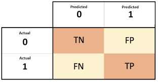

## Pipeline

### Main concepts in Pipelines
MLlib standardizes APIs for machine learning algorithms to make it easier to combine multiple algorithms into a single pipeline, or workflow. This section covers the key concepts introduced by the Pipelines API, where the pipeline concept is mostly inspired by the scikit-learn project.

* **DataFrame**: This ML API uses DataFrame from Spark SQL as an ML dataset, which can hold a variety of data types. E.g., a DataFrame could have different columns storing text, feature vectors, true labels, and predictions.

* **Transformer**: A Transformer is an algorithm which can transform one DataFrame into another DataFrame. E.g., an ML model is a Transformer which transforms a DataFrame with features into a DataFrame with predictions.

* **Estimator**: An Estimator is an algorithm which can be fit on a DataFrame to produce a Transformer. E.g., a learning algorithm is an Estimator which trains on a DataFrame and produces a model.

* **Pipeline**: A Pipeline chains multiple Transformers and Estimators together to specify an ML workflow.

* **Parameter**: All Transformers and Estimators now share a common API for specifying parameters.

### DataFrame

Machine learning can be applied to a wide variety of data types, such as vectors, text, images, and structured data. This API adopts the DataFrame from Spark SQL in order to support a variety of data types.

DataFrame supports many basic and structured types; see the Spark SQL datatype reference for a list of supported types. In addition to the types listed in the Spark SQL guide, DataFrame can use ML Vector types.

A DataFrame can be created either implicitly or explicitly from a regular RDD. See the code examples below and the Spark SQL programming guide for examples.

Columns in a DataFrame are named. The code examples below use names such as “text,” “features,” and “label.”

### **Pipeline components**

### Transformers
A Transformer is an abstraction that includes feature transformers and learned models. Technically, a Transformer implements a method transform(), which converts one DataFrame into another, generally by appending one or more columns. For example:

* A feature transformer might take a DataFrame, read a column (e.g., text), map it into a new column (e.g., feature vectors), and output a new DataFrame with the mapped column appended.

* A learning model might take a DataFrame, read the column containing feature vectors, predict the label for each feature vector, and output a new DataFrame with predicted labels appended as a column.

### Estimators
An Estimator abstracts the concept of a learning algorithm or any algorithm that fits or trains on data. Technically, an Estimator implements a method fit(), which accepts a DataFrame and produces a Model, which is a Transformer. For example, a learning algorithm such as LogisticRegression is an Estimator, and calling fit() trains a LogisticRegressionModel, which is a Model and hence a Transformer.

### Properties of pipeline components
Transformer.transform()s and Estimator.fit()s are both stateless. In the future, stateful algorithms may be supported via alternative concepts.

Each instance of a Transformer or Estimator has a unique ID, which is useful in specifying parameters (discussed below).

## Pipeline
In machine learning, it is common to run a sequence of algorithms to process and learn from data. E.g., a simple text document processing workflow might include several stages:

* Split each document’s text into words.
* Convert each document’s words into a numerical feature vector.
* Learn a prediction model using the feature vectors and labels.

MLlib represents such a workflow as a Pipeline, which consists of a sequence of PipelineStages (Transformers and Estimators) to be run in a specific order. We will use this simple workflow as a running example in this section.

### How it works

A Pipeline is specified as a sequence of stages, and each stage is either a Transformer or an Estimator. These stages are run in order, and the input DataFrame is transformed as it passes through each stage. For Transformer stages, the transform() method is called on the DataFrame. For Estimator stages, the fit() method is called to produce a Transformer (which becomes part of the PipelineModel, or fitted Pipeline), and that Transformer’s transform() method is called on the DataFrame.

We illustrate this for the simple text document workflow. The figure below is for the training time usage of a Pipeline.

Above, the top row represents a Pipeline with three stages. The first two (Tokenizer and HashingTF) are Transformers (blue), and the third (LogisticRegression) is an Estimator (red). The bottom row represents data flowing through the pipeline, where cylinders indicate DataFrames. The Pipeline.fit() method is called on the original DataFrame, which has raw text documents and labels. The Tokenizer.transform() method splits the raw text documents into words, adding a new column with words to the DataFrame. The HashingTF.transform() method converts the words column into feature vectors, adding a new column with those vectors to the DataFrame. Now, since LogisticRegression is an Estimator, the Pipeline first calls LogisticRegression.fit() to produce a LogisticRegressionModel. If the Pipeline had more Estimators, it would call the LogisticRegressionModel’s transform() method on the DataFrame before passing the DataFrame to the next stage.

A Pipeline is an Estimator. Thus, after a Pipeline’s fit() method runs, it produces a PipelineModel, which is a Transformer. This PipelineModel is used at test time; the figure below illustrates this usage.

In the figure above, the PipelineModel has the same number of stages as the original Pipeline, but all Estimators in the original Pipeline have become Transformers. When the PipelineModel’s transform() method is called on a test dataset, the data are passed through the fitted pipeline in order. Each stage’s transform() method updates the dataset and passes it to the next stage.

Pipelines and PipelineModels help to ensure that training and test data go through identical feature processing steps.

### Details
DAG Pipelines: A Pipeline’s stages are specified as an ordered array. The examples given here are all for linear Pipelines, i.e., Pipelines in which each stage uses data produced by the previous stage. It is possible to create non-linear Pipelines as long as the data flow graph forms a Directed Acyclic Graph (DAG). This graph is currently specified implicitly based on the input and output column names of each stage (generally specified as parameters). If the Pipeline forms a DAG, then the stages must be specified in topological order.

Runtime checking: Since Pipelines can operate on DataFrames with varied types, they cannot use compile-time type checking. Pipelines and PipelineModels instead do runtime checking before actually running the Pipeline. This type checking is done using the DataFrame schema, a description of the data types of columns in the DataFrame.

Unique Pipeline stages: A Pipeline’s stages should be unique instances. E.g., the same instance myHashingTF should not be inserted into the Pipeline twice since Pipeline stages must have unique IDs. However, different instances myHashingTF1 and myHashingTF2 (both of type HashingTF) can be put into the same Pipeline since different instances will be created with different IDs.

### Parameters
MLlib Estimators and Transformers use a uniform API for specifying parameters.

A Param is a named parameter with self-contained documentation. A ParamMap is a set of (parameter, value) pairs.

There are two main ways to pass parameters to an algorithm:

Set parameters for an instance. E.g., if lr is an instance of LogisticRegression, one could call lr.setMaxIter(10) to make lr.fit() use at most 10 iterations. This API resembles the API used in spark.mllib package.
Pass a ParamMap to fit() or transform(). Any parameters in the ParamMap will override parameters previously specified via setter methods.
Parameters belong to specific instances of Estimators and Transformers. For example, if we have two LogisticRegression instances lr1 and lr2, then we can build a ParamMap with both maxIter parameters specified: ParamMap(lr1.maxIter -> 10, lr2.maxIter -> 20). This is useful if there are two algorithms with the maxIter parameter in a Pipeline.

## Confusion Matrix

In the field of artificial intelligence, a confusion matrix is ​​a tool that allows the visualization of the performance of an algorithm that is used in supervised learning. Each column in the array represents the number of predictions for each class, while each row represents the instances in the actual class. One of the benefits of confusion matrices is that they make it easy to see if the system is confusing the last classes or results of the classification.

### Expample

What can we learn from this matrix?

* There are two possible predicted classes: "yes" and "no". If we were predicting the presence of a disease, for example, "yes" would mean they have the disease, and "no" would mean they don't have the disease.
* The classifier made a total of 165 predictions (e.g., 165 patients were being tested for the presence of that disease).
* Out of those 165 cases, the classifier predicted "yes" 110 times, and "no" 55 times.
* In reality, 105 patients in the sample have the disease, and 60 patients do not.

Let's now define the most basic terms, which are whole numbers (not rates):

* true positives (TP): These are cases in which we predicted yes (they have the disease), and they do have the disease.
* true negatives (TN): We predicted no, and they don't have the disease.
* false positives (FP): We predicted yes, but they don't actually have the disease. (Also known as a "Type I error.")
* false negatives (FN): We predicted no, but they actually do have the disease. (Also known as a "Type II error.")
I've added these terms to the confusion matrix, and also added the row and column totals:

This is a list of rates that are often computed from a confusion matrix for a binary classifier:

* **Accuracy**: Overall, how often is the classifier correct?
(TP+TN)/total = (100+50)/165 = 0.91
* **Misclassification Rate**: Overall, how often is it wrong?
(FP+FN)/total = (10+5)/165 = 0.09
equivalent to 1 minus Accuracy
also known as "Error Rate"
* **True Positive Rate**: When it's actually yes, how often does it predict yes?
TP/actual yes = 100/105 = 0.95
also known as "Sensitivity" or "Recall"
* **False Positive Rate**: When it's actually no, how often does it predict yes?
FP/actual no = 10/60 = 0.17
* **True Negative Rate**: When it's actually no, how often does it predict no?
TN/actual no = 50/60 = 0.83
equivalent to 1 minus False Positive Rate
also known as "Specificity"
* **Precision**: When it predicts yes, how often is it correct?
TP/predicted yes = 100/110 = 0.91
* **Prevalence**: How often does the yes condition actually occur in our sample?
actual yes/total = 105/165 = 0.64

A couple other terms are also worth mentioning:

* **Null Error Rate**: This is how often you would be wrong if you always predicted the majority class. (In our example, the null error rate would be 60/165=0.36 because if you always predicted yes, you would only be wrong for the 60 "no" cases.) This can be a useful baseline metric to compare your classifier against. However, the best classifier for a particular application will sometimes have a higher error rate than the null error rate, as demonstrated by the Accuracy Paradox.
* **Cohen's Kappa**: This is essentially a measure of how well the classifier performed as compared to how well it would have performed simply by chance. In other words, a model will have a high Kappa score if there is a big difference between the accuracy and the null error rate. (More details about Cohen's Kappa.)
* **F Score**: This is a weighted average of the true positive rate (recall) and precision. (More details about the F Score.)
* **ROC Curve**: This is a commonly used graph that summarizes the performance of a classifier over all possible thresholds. It is generated by plotting the True Positive Rate (y-axis) against the False Positive Rate (x-axis) as you vary the threshold for assigning observations to a given class. (More details about ROC Curves.)

## References

* https://spark.apache.org/docs/latest/ml-pipeline.html
* https://www.juanbarrios.com/matriz-de-confusion-y-sus-metricas/
* https://www.dataschool.io/simple-guide-to-confusion-matrix-terminology/