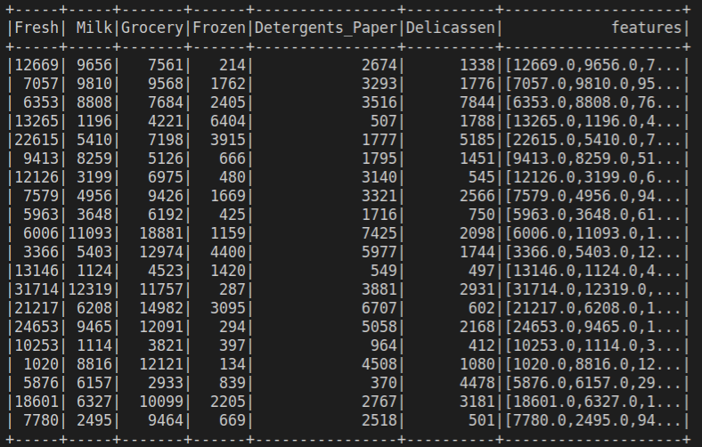
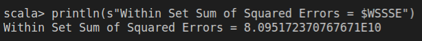
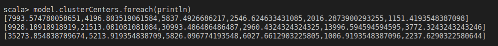

# Unit 3

1. Import a simple Spark session.
```scala
import org.apache.spark.sql.SparkSession
```

2. Use the lines of code to minimize errors

```scala
import org.apache.log4j._
Logger.getLogger("org").setLevel(Level.ERROR)
```

3. We create an instance of the Spark session

```scala
val spark = SparkSession.builder().getOrCreate()
```

4. We import the Kmeans library for the grouping algorithm.
```scala
import org.apache.spark.ml.clustering.KMeans
```

5. We load the Wholesale Customers Data dataset

```scala
//val dataset = spark.read.format("libsvm").load("/home/eduardo/Escritorio/DatosMasivos/Unidad3/Whole_sale_customers_data.csv")
val dataset = spark.read.option("header","true").option("inferSchema","true").csv("/home/eduardo/Escritorio/DatosMasivos/Unidad3/Whole_sale_customers_data.csv")
dataset.show
```
6. We select the following columns: Fresh, Milk, Grocery, Frozen, Detergents_Paper, Delicassen and call this set feature_data

```scala
val  feature_data  = dataset.select("Fresh","Milk","Grocery","Frozen","Detergents_Paper","Delicassen")
feature_data.show
```
7. Import Vectorassembler and Vector

```scala
import org.apache.spark.ml.feature.VectorAssembler
```
8. We create a new Vector Assembler object for the feature columns as an input set, remembering that there are no labels

```scala
val assembler = new VectorAssembler().setInputCols(Array("Fresh","Milk","Grocery","Frozen","Detergents_Paper","Delicassen")).setOutputCol("features")
```

9. Use the assembler object to transform feature_data

```scala
val  features = assembler.transform(feature_data)
features.show
```


10. We create a Kmeans model with K = 3

```scala
val kmeans = new KMeans().setK(3).setSeed(1L)
val model = kmeans.fit(features)
```
11. We evaluate the groups using Within Set Sum of Squared Errors WSSSE and print the centroids.

```scala
val WSSSE = model.computeCost(features)
println(s"Within Set Sum of Squared Errors = $WSSSE")
```


12. Print cluster centers
```scala
println("Cluster Centers: ")
model.clusterCenters.foreach(println)
```

